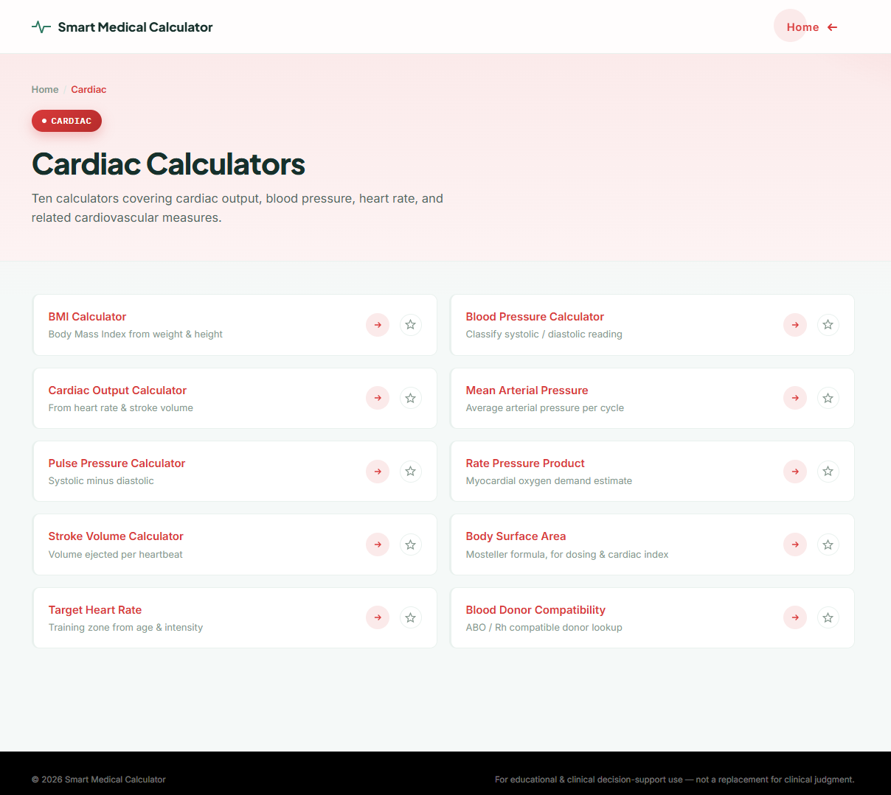
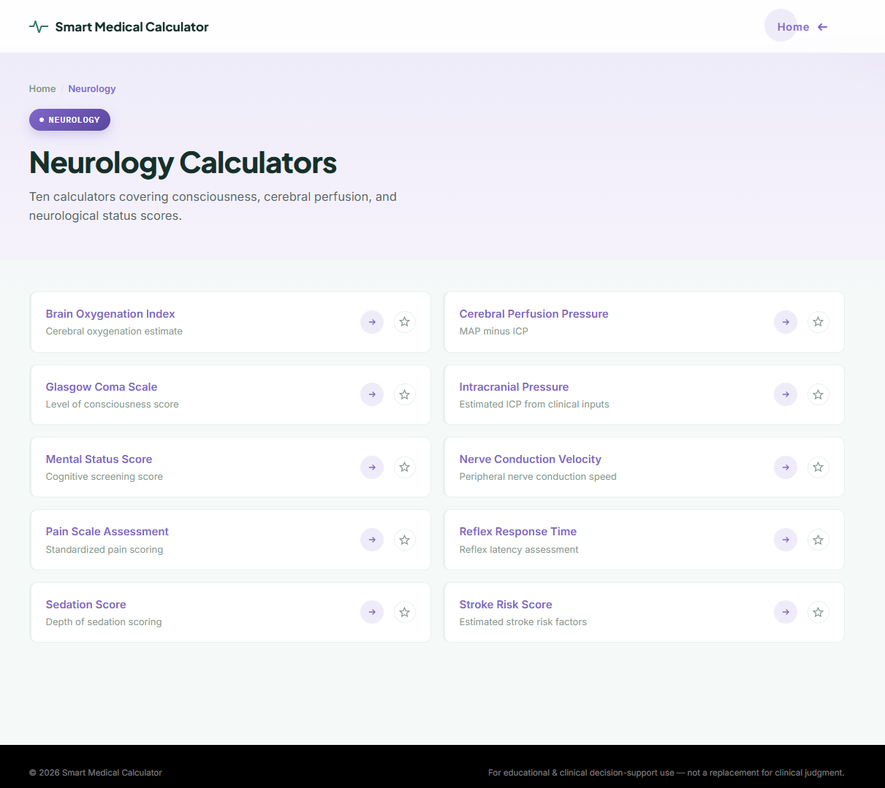
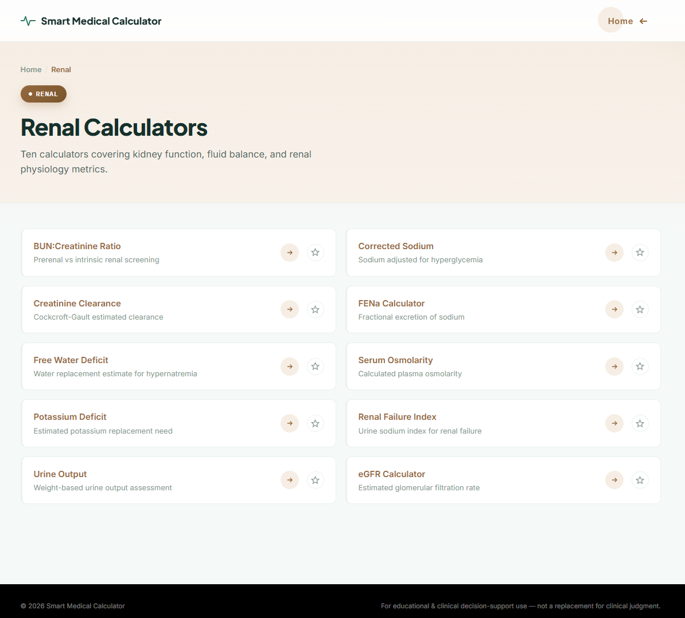
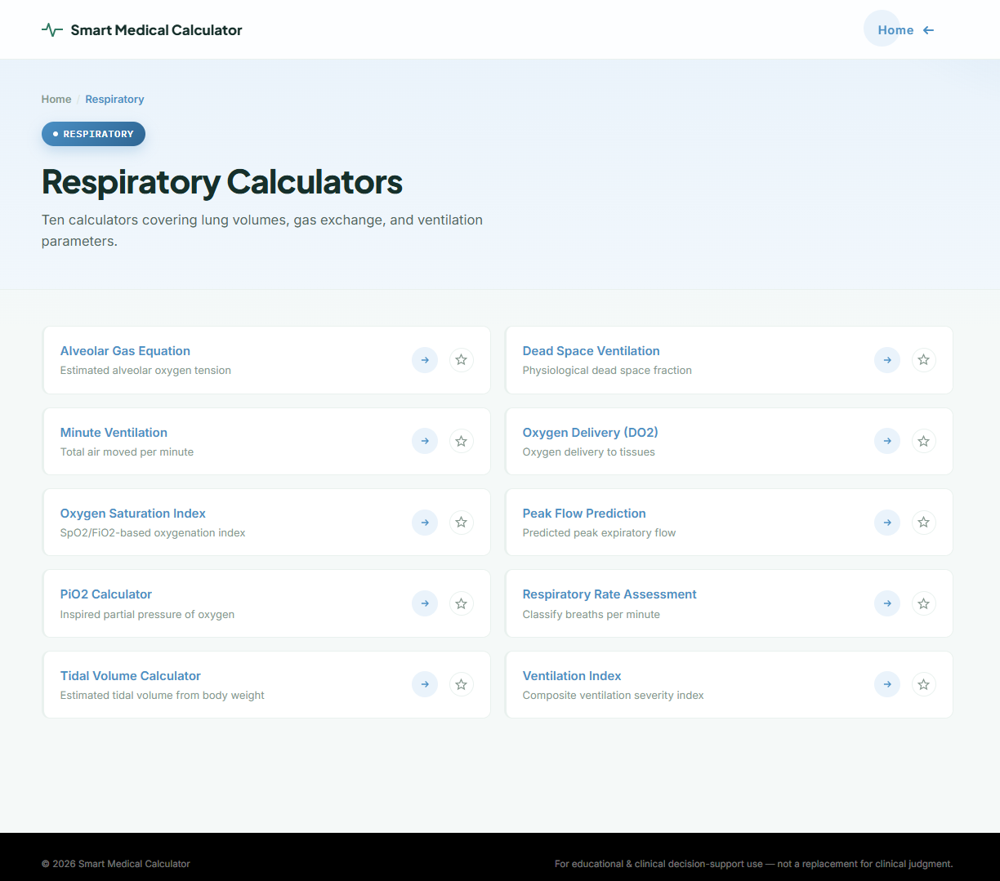
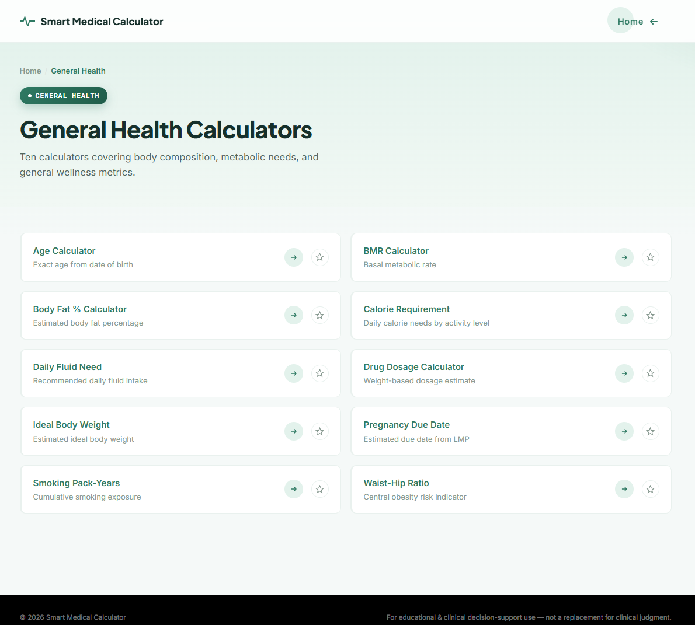
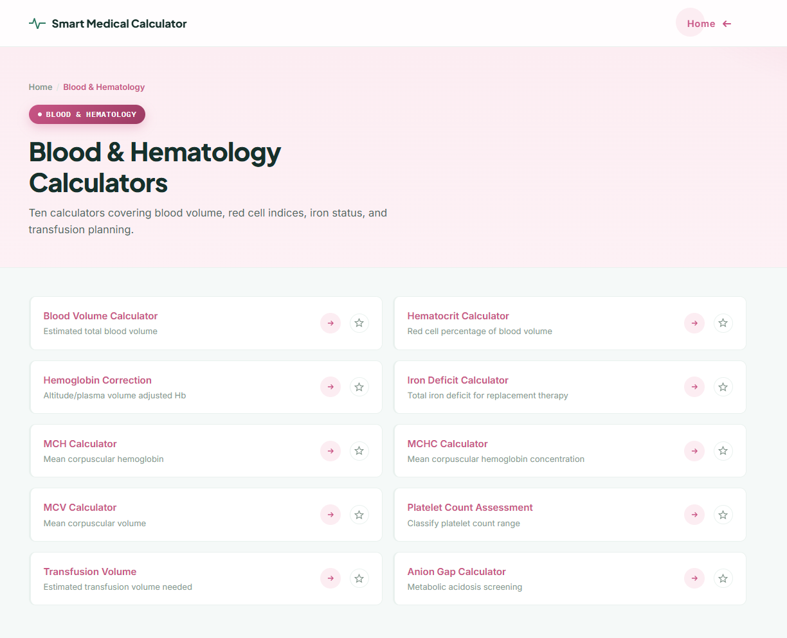

MedCalculator

A web-based clinical calculator suite that brings 60 medical calculators into a single, structured platform. Built to give students and healthcare professionals fast, formula-accurate results with clear visual interpretation.

Overview

Medical professionals and students often rely on scattered tools and references for different clinical calculations. MedCalculator centralizes this workflow into one dashboard: select a clinical category, choose a calculator, enter the required parameters, and get an instant, color-coded, interpreted result.

The platform covers six major clinical categories — Cardiac, Respiratory, Blood & Hematology, Renal, General Health, and Neurology — with 10 calculators each, for a total of 60 calculators.

All formulas used in this project were selected and cross-verified against multiple published medical research papers to ensure clinical accuracy rather than relying on a single source.

Key Features
60 medical calculators across 6 clinical categories
Category-based dashboards for quick navigation
Color-coded result cards for instant visual interpretation
Formulas cross-referenced against multiple research papers
Simple, structured, responsive web interface
Lightweight — no backend or build step required to run
Calculator Categories
Cardiac Calculators

The cardiac section contains calculators related to cardiovascular and general physiological assessment.

Blood Pressure Category
Body Mass Index (BMI)
Cardiac Output
Mean Arterial Pressure
Perfect Blood Donor
Pulse Pressure
Rate Pressure Product
Stroke Volume
Body Surface Area
Target Heart Rate
Respiratory Calculators

The respiratory section provides calculations related to pulmonary function, ventilation, and oxygenation.

Alveolar Gas Equation
Dead Space Ventilation
Minute Ventilation
Oxygen Delivery
Oxygen Saturation Index
Peak Flow Prediction
Partial Pressure of Inspired Oxygen (PiO₂)
Respiratory Rate
Tidal Volume
Ventilation Index
Blood & Hematology Calculators

The blood and hematology section provides calculations related to blood parameters and hematological assessment.

Anion Gap
Blood Volume
Hematocrit
Hemoglobin Correction
Iron Deficit
MCH
MCHC
MCV
Platelet Count Assessment
Transfusion Volume
Renal Calculators

The renal section contains calculators related to kidney function, electrolytes, and fluid balance.

BUN/Creatinine Ratio
Corrected Sodium
Creatinine Clearance
eGFR
Fractional Excretion of Sodium (FENa)
Free Water Deficit
Osmolarity
Potassium Deficit
Renal Failure Index
Urine Output
General Health Calculators

The general health section provides commonly used health, nutrition, body composition, and dosage calculations.

Basal Metabolic Rate
Body Fat Percentage
Calorie Requirement
Daily Fluid Need
Drug Dosage
General Health Assessment
Ideal Body Weight
Pregnancy Due Date
Smoking Pack-Years
Waist-Hip Ratio
Neurology / Brain Calculators

The neurological section contains calculators and scoring systems related to neurological and brain assessment.

Cerebral Metabolic Rate
Cerebral Perfusion Pressure
Glasgow Coma Scale
Hunt and Hess Scale
Intracranial Pressure
Modified Rankin Scale
Nerve Conduction Velocity
Pain Scale
Richmond Agitation-Sedation Scale
Stroke Risk Score
Result-Based Health Indication

MedCalculator uses color-coded result cards to provide a quick visual indication of the calculated result. The result card changes based on the interpreted value, allowing users to easily distinguish between normal and potentially concerning results.

Result Status	Visual Indication
Normal / Healthy	Green result card
Danger / High-Risk	Red result card

Green indicates that the calculated result is within the defined normal range, while red indicates that the result falls within a defined danger or high-risk range.

Screenshots

The project includes category dashboards for each clinical specialty, and these screenshots match the files currently stored in the repository.

  
  
  

  
  
  

Tech Stack

Frontend

HTML5
CSS3
JavaScript

Tooling

Visual Studio Code
Git & GitHub
How It Works
text
Homepage
    |
Select Clinical Category (Cardiac / Respiratory / Blood / Renal / General / Neurology)
    |
Category Dashboard
    |
Select Calculator
    |
Enter Clinical Parameters
    |
Calculate Result
    |
Color-Coded Result Card (Green = Normal, Red = Danger)
Project Structure
text
med-calculator/
├── .vscode/
│
├── bloodpage/
│   ├── AnionGapCalculator.html
│   ├── blooddashboard.html
│   ├── BloodVolumeCalculator.html
│   ├── HematocritCalculator.html
│   ├── HemoglobinCorrection.html
│   ├── IronDeficitCalculator.html
│   ├── MCHCalculator.html
│   ├── MCHCCalculator.html
│   ├── MCVCalculator.html
│   ├── PlateletCountAssessment.html
│   └── TransfusionVolume.html
│
├── brainpage/
│   ├── braindashboard.html
│   ├── CerebralMetabolicRate.html
│   ├── CerebralPerfusionPressure.html
│   ├── GlasgowComaScale.html
│   ├── HuntHessScale.html
│   ├── IntracranialPressure.html
│   ├── ModifiedRankinScale.html
│   ├── NerveConductionVelocity.html
│   ├── PainScale.html
│   ├── RichmondAgitationSedationScale.html
│   └── StrokeRiskScore.html
│
├── cardiopage/
│   ├── bloodPressureCatogury.html
│   ├── BMI.html
│   ├── cardicoutput.html
│   ├── cardiodashboard.html
│   ├── meanartialpressure.html
│   ├── PerfectBloodDonor.html
│   ├── pulsepressure.html
│   ├── ratepressureproduct.html
│   ├── stokevolume.html
│   ├── surfacearea.html
│   └── TargetHeartRate.html
│
├── gendralpage/
│   ├── BMR.html
│   ├── BodyFatPercent.html
│   ├── CalorieRequirement.html
│   ├── DailyFluidNeed.html
│   ├── DrugDosageCalculator.html
│   ├── gendraldashboard.html
│   ├── general_health_calc.html
│   ├── IdealBodyWeight.html
│   ├── PregnancyDueDate.html
│   ├── SmokingPackYears.html
│   ├── WaistHipRatio.html
│   └── homepage/
│       ├── aboutus.html
│       ├── favorites.js
│       ├── feedback.html
│       └── homepage.html
│
├── lungspage/
│   ├── AlveolarGasEquation.html
│   ├── DeadSpaceVentilation.html
│   ├── lungsdashboard.html
│   ├── MinuteVentilation.html
│   ├── OxygenDelivery.html
│   ├── OxygenSaturationIndex.html
│   ├── PeakFlowPrediction.html
│   ├── PiO2.html
│   ├── RespiratoryRate.html
│   ├── TidalVolume.html
│   └── VentilationIndex.html
│
├── renalpage/
│   ├── BUNCreatinineRatio.html
│   ├── CorrectedSodium.html
│   ├── CreatinineClearance.html
│   ├── eGFR.html
│   ├── FENa.html
│   ├── FreeWaterDeficit.html
│   ├── kidney_cal.html
│   ├── Osmolarity.html
│   ├── PotassiumDeficit.html
│   ├── renaldashboard.html
│   ├── RenalFailureIndex.html
│   └── UrineOutput.html
│
└── README.md

Update this tree if the repository structure changes.

Formula Sources

Formulas used across all 60 calculators were selected and cross-checked against multiple published medical research papers and established clinical reference formulas, rather than a single source, to reduce the risk of using an outdated or non-standard equation. Where a formula has more than one accepted clinical variant, the most widely cited version was used.

Medical Disclaimer

MedCalculator is an educational and software-development project intended to demonstrate digital clinical assessment concepts.

Results generated by this application are not a substitute for professional medical diagnosis, clinical judgment, or treatment. Medical decisions should always be made by qualified healthcare professionals.

Author

S. Sriram B.Tech Computer Science and Medical Engineering GitHub: @sriramS-12112007

License

This project is developed for educational and research purposes.
